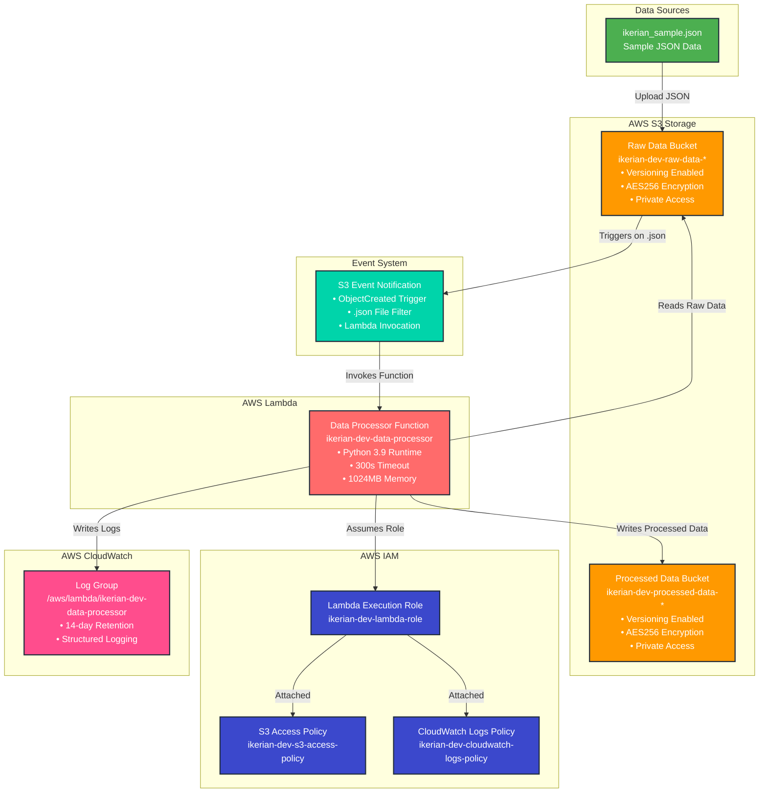

# Architecture Diagram

## AWS Data Pipeline Architecture



## Detailed Component Description

### 1. Data Ingestion Layer
- **Source File**: `files/s3/ikerian_sample.json` - Sample JSON data with patient records
- **Storage**: Raw data stored in `ikerian-dev-raw-data-*` S3 bucket with versioning and AES256 encryption enabled
- **Auto-upload**: Sample data automatically uploaded during Terraform deployment

### 2. Processing Layer
- **Trigger Event**: S3 ObjectCreated event triggered for `.json` file uploads into the raw data bucket
- **Function**: AWS Lambda `ikerian-dev-data-processor` with Python 3.9 runtime
- **Configuration**: 300-second timeout, 1024MB memory allocation
- **Processing**: Validates and extracts `patient_id` and `patient_name` fields from JSON data
- **Error Handling**: Comprehensive validation with detailed error reporting

### 3. Storage Layer
- **Raw Storage**: `ikerian-dev-raw-data-*` S3 bucket for incoming JSON files
- **Processed Storage**: `ikerian-dev-processed-data-*` S3 bucket for validated results
- **Security**: AES256 server-side encryption, public access blocked, versioning enabled
- **Lifecycle**: Automated storage class transitions (Standard → Standard-IA → Glacier)

### 4. Security Layer
- **IAM Role**: `ikerian-dev-lambda-role` with minimal required permissions
- **S3 Policy**: `ikerian-dev-s3-access-policy` for read/write access to specific buckets
- **CloudWatch Policy**: `ikerian-dev-cloudwatch-logs-policy` for logging permissions
- **Principle**: Least privilege access with bucket-specific permissions

### 5. Monitoring Layer
- **Log Group**: `/aws/lambda/ikerian-dev-data-processor` with 14-day retention
- **Observability**: Structured logging for debugging and monitoring
- **Error Tracking**: Detailed error reports stored in processed bucket for failed validations

## Data Flow Sequence

1. **Upload**: JSON file uploaded to `ikerian-dev-raw-data-*` bucket
2. **Event Trigger**: S3 ObjectCreated event fires for `.json` files
3. **Lambda Invocation**: `ikerian-dev-data-processor` function triggered automatically
4. **Data Reading**: Lambda reads JSON data from raw bucket using IAM role permissions
5. **Validation**: Comprehensive validation of data structure and required fields
6. **Processing**: Extract and validate `patient_id` and `patient_name` fields
7. **Output**: Processed data written to `ikerian-dev-processed-data-*` bucket with timestamp
8. **Error Handling**: Validation errors stored as error reports in processed bucket
9. **Logging**: All operations logged to CloudWatch with structured logging

## Security Architecture

```
┌────────────────────────────────────────────────────────────┐
│                    AWS Account Boundary                    | 
├────────────────────────────────────────────────────────────|
│  ┌─────────────┐    ┌─────────────┐    ┌─────────────┐     │
│  │ S3 Raw Data │    │S3 Processed │    │   Lambda    │     │
│  │   Bucket    │    │   Bucket    │    │  Function   │     │
│  │             │    │             │    │             │     │
│  │ • AES256    │    │ • AES256    │    │ • IAM Role  │     │
│  │ • Private   │    │ • Private   │    │ • No VPC    │     │
│  │ • Versioned │    │ • Versioned │    │ • 300s TO   │     │
│  │ • Lifecycle │    │ • Lifecycle │    │ • 1024MB    │     │
│  └─────────────┘    └─────────────┘    └─────────────┘     │
│           │                 │                 │            │
│           └─────────────────┼─────────────────┘            │
│                             │                              │
│  ┌─────────────┐    ┌─────────────┐    ┌─────────────┐     │
│  │    IAM      │    │ CloudWatch  │    │   S3 Event  │     │
│  │   Role      │    │    Logs     │    │ Notification│     │
│  │             │    │             │    │             │     │
│  │ • S3 Policy │    │ • 14-day    │    │ • .json Only│     │
│  │ • Logs Policy│   │ • Retention │    │ • Auto      │     │
│  │ • Least Priv│    │ • Structured│    │ • Trigger   │     │
│  └─────────────┘    └─────────────┘    └─────────────┘     │
└────────────────────────────────────────────────────────────┘
```

## Scalability Considerations

- **Concurrent Processing**: Multiple JSON files can be processed simultaneously by Lambda
- **Auto-scaling**: Lambda automatically scales based on demand (up to 1000 concurrent executions)
- **Storage**: S3 provides unlimited storage with automated lifecycle policies (Standard → Standard-IA → Glacier)
- **Performance**: Lambda configured with 300s timeout and 1024MB memory for optimal processing
- **Error Handling**: Robust validation prevents processing failures and provides detailed error reports
- **Monitoring**: CloudWatch logs provide comprehensive observability for troubleshooting and optimization
